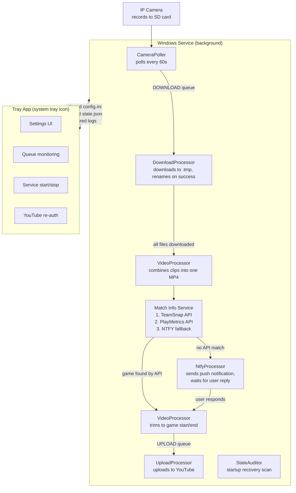
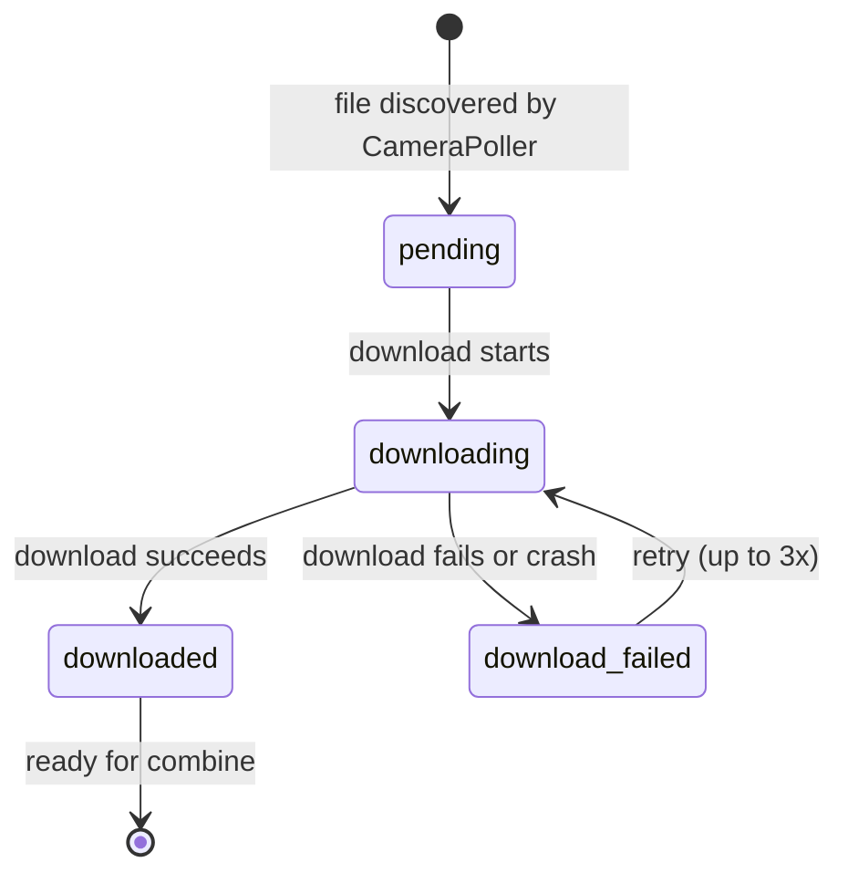
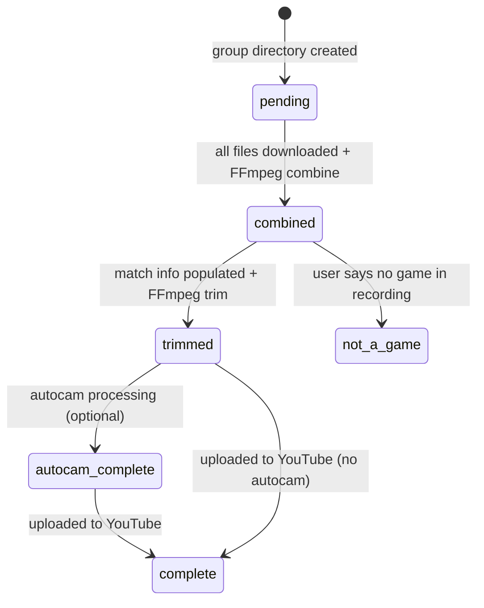
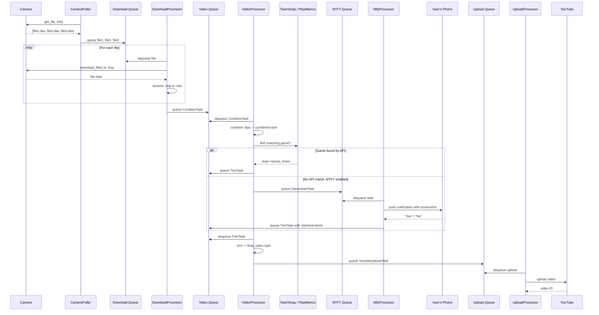
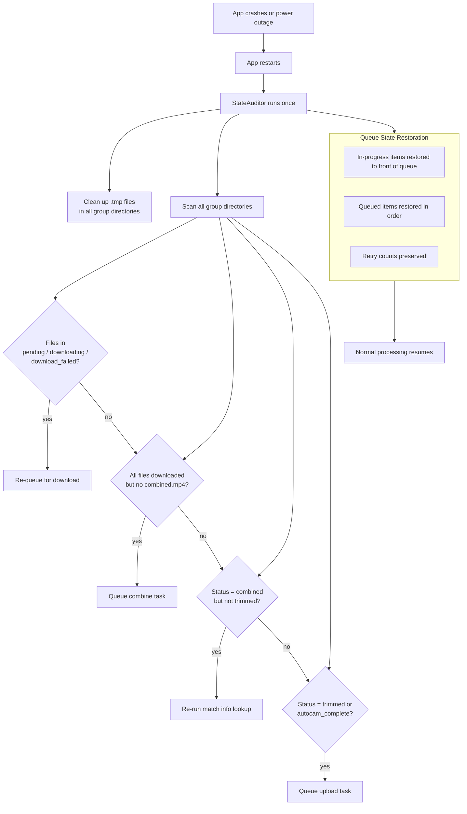
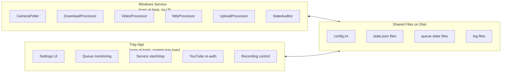

# Data Flow Diagrams

## Pipeline Overview



## File State Machine



## Group State Machine



## Queue Interactions



## Crash Recovery Flow



## Directory Layout

```
storage_path/
  +-- config.ini                    # Application configuration
  +-- camera_state.json             # Camera connection history
  +-- download_queue_state.json     # Persisted download queue
  +-- video_queue_state.json        # Persisted video processing queue
  +-- upload_queue_state.json       # Persisted upload queue
  +-- ntfy_service_state.json       # NTFY pending requests
  |
  +-- logs/
  |     +-- video_grouper.log       # Application log (rotated daily)
  |
  +-- youtube/
  |     +-- client_secret.json      # Google OAuth credentials
  |     +-- token.json              # Cached OAuth token
  |
  +-- 2026.03.22-09.00.00/          # Video group (one per game)
  |     +-- state.json              # Processing state
  |     +-- match_info.ini          # Game metadata (teams, times)
  |     +-- file1.dav               # Downloaded camera recording
  |     +-- file2.dav
  |     +-- file3.dav
  |     +-- combined.mp4            # All clips joined
  |     +-- trimmed_Eagles_vs_Falcons_2026-03-22_090000.mp4
  |
  +-- 2026.03.15-10.30.00/          # Another game
        +-- ...
```

## Service vs Tray App



The service does all the work. The tray app is a window into what's happening and a way to change settings. They run independently -- you don't need the tray app for the pipeline to work.
